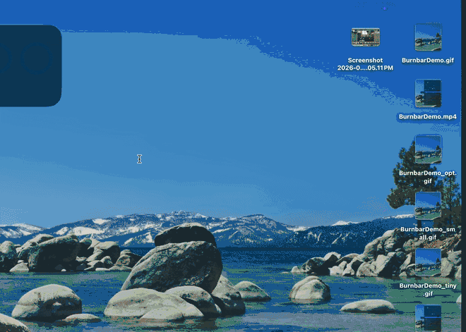
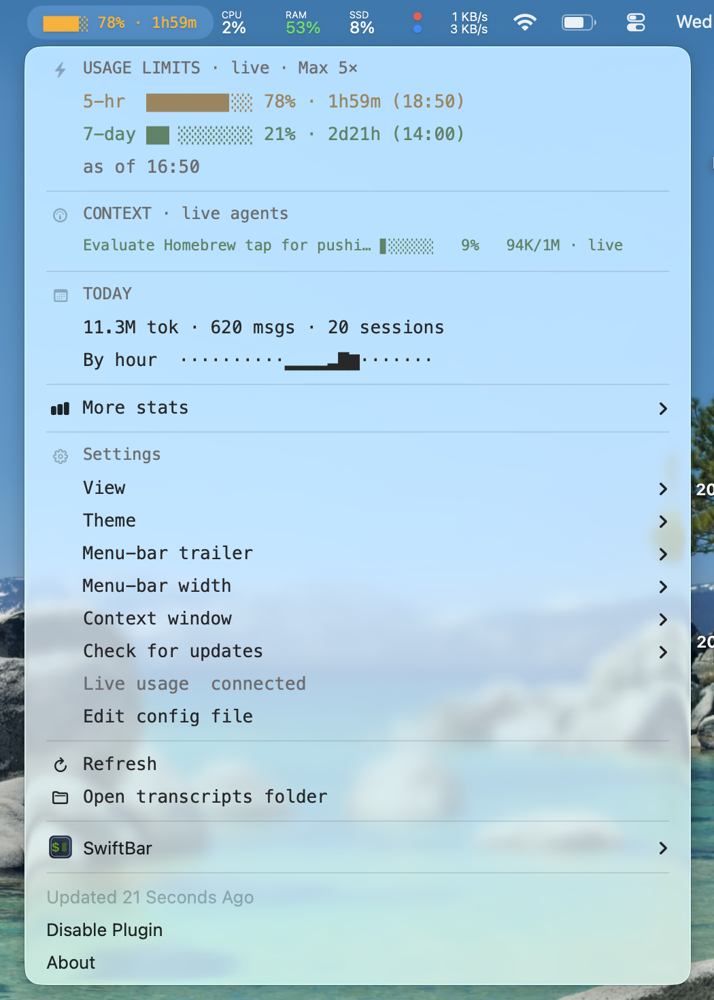
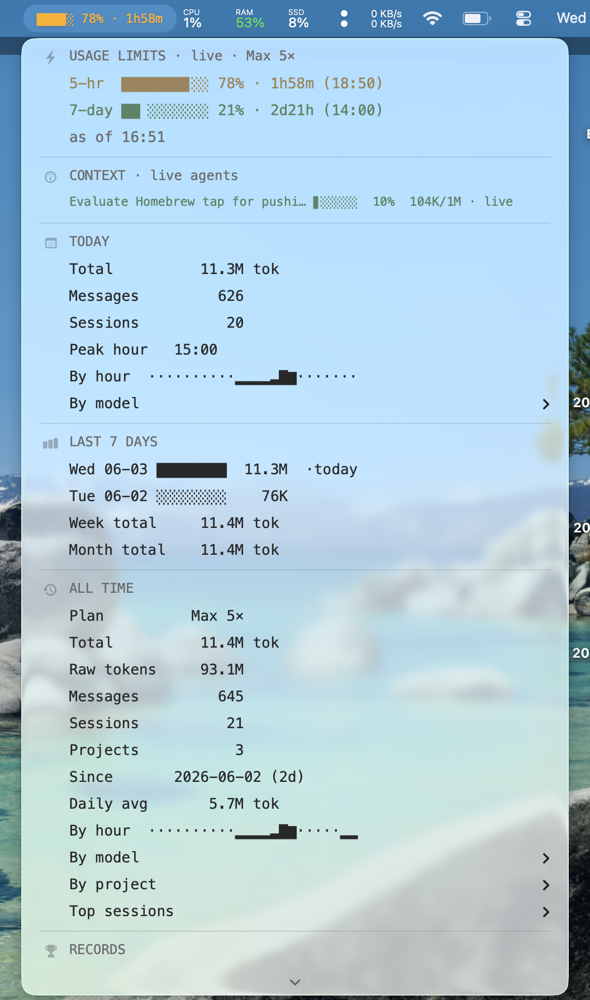

# burnbar

A [SwiftBar](https://swiftbar.app) plugin that shows your **real Claude Code
usage limits** — the same numbers the `/usage` command shows — as a progress bar
that fills up, right in the macOS menu bar, with a live reset countdown:

```
███▉░ 37% · 3h09m
```

It pulls Anthropic's live `rate_limits` (5-hour, 7-day, Opus) and pairs them with
rich token stats from your own local transcripts. No `ccusage`, no API keys, no
pricing tables, no telemetry — your usage never leaves your machine. (The lone
exception: an optional once-a-day check to GitHub for a newer version — it sends
nothing about you, and it's one toggle away in Settings.)

<p align="center">
  
</p>

<p align="center">
  
  &nbsp;&nbsp;
  
</p>
<p align="center"><em>Compact view (left, the default) and Detailed view (right).</em></p>

Click it for a **Stats-style dropdown** with SF Symbol section headers:

- **Usage limits (live)** — 5-hour / 7-day / Opus, each a fill bar with exact
  `used_percentage` and time-to-reset, straight from Anthropic (cross-surface)
- **Context (live agents)** — how full each *open* session's context window is, so
  at a glance you can tell which session still has room and which is about to
  auto-compact. burnbar shows the sessions that are genuinely running (it matches
  live `claude` processes to their working dir, so a window you closed drops off
  right away), labels each with Claude's own session title (the one in the resume
  picker), and nests any subagents under the session that spawned them
- **Today** — total tokens, messages, sessions, today's git commits, peak hour, hourly sparkline, by model
- **Last 7 days** — per-day mini bars, week + month totals
- **All time** — totals, raw vs effective tokens, sessions, projects, daily
  average, 24-hour activity sparkline, by model, by project, top sessions
- **Records** — busiest 5-hour block ever, busiest day
- **Recent blocks** — your latest rolling windows, the live one highlighted
- **Settings** — view, theme, menu-bar trailer & width (no JSON editing)

## Install

One line, no clone:

```sh
curl -fsSL https://raw.githubusercontent.com/dashpes/burnbar/main/install.sh | bash
```

This downloads the two scripts into `~/.local/share/burnbar`, then does the rest.
Prefer a checkout (so `git pull` updates it)? That works too:

```sh
git clone https://github.com/dashpes/burnbar.git && cd burnbar && ./install.sh
```

Either way `install.sh` will: install SwiftBar (via Homebrew) if missing, symlink
the plugin into SwiftBar's folder, offer to **launch SwiftBar at login** (so
burnbar runs on startup), offer to wire **live usage**, and refresh. That's it.

**Unattended / flags** — take every default with no prompts:

```sh
curl -fsSL https://raw.githubusercontent.com/dashpes/burnbar/main/install.sh | bash -s -- -y
```

| Flag         | Effect                                              |
| ------------ | --------------------------------------------------- |
| `-y, --yes`  | non-interactive; take the default for every prompt  |
| `--no-login` | skip the SwiftBar login item                        |
| `--no-live`  | skip wiring the live-usage statusLine bridge        |

> When piped through `curl`, prompts read from your terminal (`/dev/tty`); with
> no terminal it falls back to the defaults, same as `-y`.

<details>
<summary>Manual install</summary>

```sh
brew install --cask swiftbar          # then launch & pick a plugin folder
ln -sf "$PWD/burnbar.30s.py" ~/.swiftbar/burnbar.30s.py
open "swiftbar://refreshallplugins"
```
</details>

## Updating

burnbar checks GitHub for a newer version **at most once a day** (a plain
version-only GET — nothing about your usage is sent). When one is out, an
**Update to x.y.z** row appears at the top of the dropdown; clicking it opens a
Terminal and updates in place — `git pull` for a checkout, or a re-run of
`install.sh` for a `curl` install — then refreshes SwiftBar.

Don't want the check? Flip **Settings → Check for updates → Off**; burnbar then
makes no network calls at all. You can always update by hand:

```sh
# checkout install
cd /path/to/burnbar && git pull && ./install.sh
# curl install
curl -fsSL https://raw.githubusercontent.com/dashpes/burnbar/main/install.sh | bash -s -- -y
```

The `30s` in the filename is the refresh interval — rename to `burnbar.1m.py`,
`burnbar.10s.py`, etc. to taste. Works with [xbar](https://xbarapp.com) too.

## Settings (no JSON editing)

Click the menu bar item → **Settings** to change things live; selections are
marked with `[x]` and saved to `~/.config/burnbar/config.json`:

- **View** — `Compact` (default: just Today + a *More stats* submenu) or
  `Detailed` (the full stats panel)
- **Theme** — `Default`, `Mono`, `Nord`, `Dracula`, `Solarized`, `Matrix`
  (recolors the bar + accent text)
- **Menu-bar trailer** — what shows after the `%`: `Reset countdown` (e.g.
  `· 3h40m`), `Token count`, or `None`
- **Menu-bar width** — bar cells: 3 / 5 / 8 / 10
- **Context window** — how the *Context* section sizes each bar: `Auto-detect`,
  `200K`, or `1M` (see below)
- **Check for updates** — `Daily` (default; a version-only GET to GitHub, see
  [Updating](#updating)) or `Off` (no network calls at all)
- **Commits today** — `On` (default) shows a count of *your* git commits made
  today in the Today section, or `Off` to hide it (which also skips the scan).
  Auto-detects you from your `git config` identity and scans common code folders
  (`~/Developer`, `~/Projects`, `~/Code`, `~/dev`, `~/src`, `~/repos`); override
  the author or folders with `commit_author` / `commit_dirs` in `config.json`.

## How the live limits work

The real numbers aren't in any file that `ccusage`-style tools read — Claude Code
only exposes them through its **statusLine** (a command it feeds a JSON blob on
every UI update). `burnbar-statusline.py` captures that `rate_limits` object to
`~/.config/burnbar/usage.json` and prints a compact status line back to Claude
Code, led by the session's own title so you can tell which terminal/tab is which:

```
Add context tracking to burnbar  5h ████░░░░ 48%·2h31m  7d 31%  Opus 4.8
```

`install.sh` offers to wire it for you. Manual setup — add to
`~/.claude/settings.json`:

```json
"statusLine": { "type": "command", "command": "/abs/path/to/burnbar-statusline.py", "padding": 0 }
```

Because Anthropic computes the limits server-side, the captured values already
include claude.ai web, Claude Code, and every machine you use — and the reset
times are exact. They refresh whenever you use Claude Code on this Mac; when
idle, burnbar shows the last-known reading with an "as of" time. Until the
bridge is wired, the menu bar shows `set up` and points you here.

> Everything stays on your machine — the bridge only writes a local file. No
> network calls, no token handling (Claude Code already holds the OAuth token).

## How it works

- **Live limits** come from Anthropic via the statusLine bridge above —
  `rate_limits` (5-hour / 7-day / Opus) with exact reset times. The menu bar `%`
  *is* your real 5-hour usage; no estimation involved.
- **Token stats** are read from `~/.claude/projects/**/*.jsonl` (Claude Code's
  local transcripts): every assistant turn's `input` / `output` /
  `cache_creation` / `cache_read`, deduped by message id + request id, grouped
  into rolling 5-hour blocks and rolled up by day / model / project / session.
- The menu bar fill bar is colored green → yellow → orange → red as it climbs,
  followed by a reset countdown (swap to a token count or nothing in Settings).
- **Context (live agents)** reads the same transcripts: a session's current
  context-window fill is its latest turn's prompt size (`input` +
  `cache_creation` + `cache_read` — what the model was actually sent). To show
  only sessions that are *actually open*, burnbar matches each running `claude`
  process to its working directory (`pgrep` + `lsof`) instead of guessing from
  recency — so a window you just closed disappears immediately, and two terminals
  in the same repo are counted separately; if it can't read processes it falls
  back to a recent-activity window. Subagents still running are nested under the
  session that spawned them (linked by the `sessionId` in each `agent-*.jsonl`)
  and drop off the moment they finish. Rows are labelled with Claude's
  auto-generated session title (the `aiTitle` it writes to the transcript and
  shows in the resume picker), falling back to the project folder and git branch.
  The bar reddens as the window fills, so a session about to compact stands out.

Claude Code's transcripts don't record the window *size*, so `Auto-detect` goes
by the model running the latest turn: Opus is the 1M-context model, so an Opus
session is sized to 1M; Haiku/Sonnet sessions use the standard 200K (with a
fallback to 1M for anything that's somehow crossed 200K). If you run a fixed
setup, pin it to `200K` or `1M` in Settings.

Cache-read tokens are down-weighted (`CACHE_READ_WEIGHT = 0.1`) in the token
stats, since they're far lighter than fresh tokens — this makes "effective
tokens" track real burn rather than cache reuse. Set it to `1.0` to count every
token equally.

## Footprint

burnbar creates no growing files of its own — `usage.json`, `config.json`, and
`cache.json` are all fixed-size or overwritten. The transcripts it reads are
written and owned by Claude Code, not burnbar.

To stay fast no matter how large that history grows, burnbar keeps an
**incremental cache** (`~/.config/burnbar/cache.json`): each transcript's totals
are cached by size + mtime, so a refresh only re-parses files that are new or
changed (or modified within `RECENT_DAYS`). Entries for deleted files are pruned
automatically. In practice a refresh stays in the tens of milliseconds even with
years of history.

## Tuning

The Settings submenu covers the common knobs. Deeper ones are constants at the
top of `burnbar.30s.py`:

| Constant            | Default   | Meaning                                      |
| ------------------- | --------- | -------------------------------------------- |
| `BLOCK_HOURS`       | `5`       | Length of a usage block                      |
| `BAR_CELLS`         | `10`      | Bar width inside the dropdown                |
| `CACHE_READ_WEIGHT` | `0.1`     | Weight applied to cache-read tokens          |
| `RECENT_DAYS`       | `3`       | Recent window re-parsed each refresh (lean)  |
| `CONTEXT_ACTIVE_MIN`| `120`     | Minutes a main session stays in *Context*    |
| `CONTEXT_AGENT_MIN` | `15`      | Minutes a subagent stays in *Context*        |
| `THEMES`            | —         | Add your own `name: {grad, text, muted}`     |

## License

MIT
